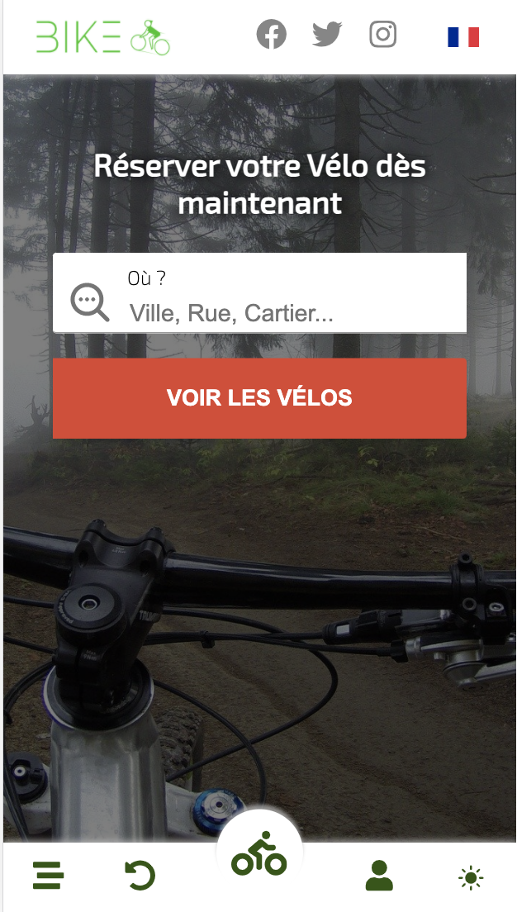
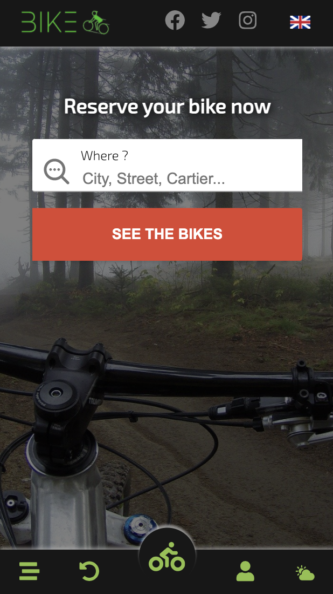
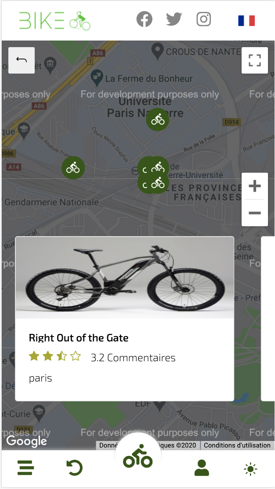
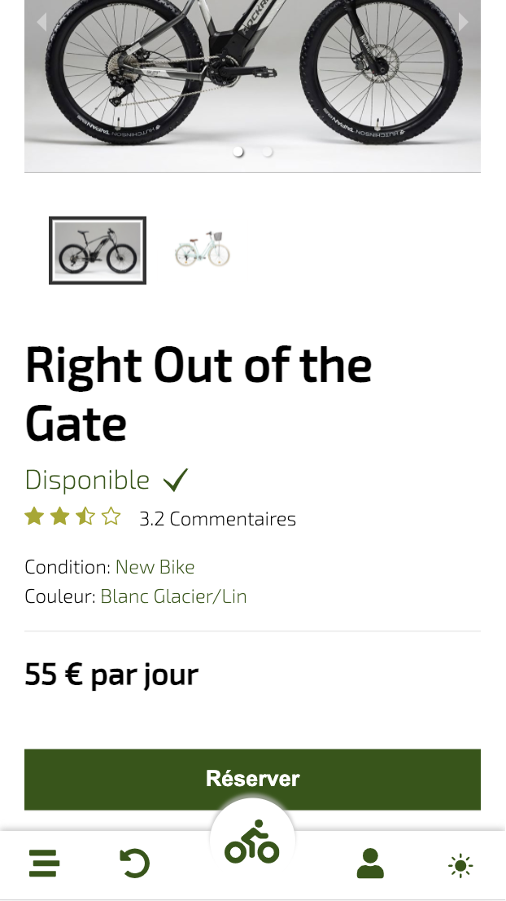
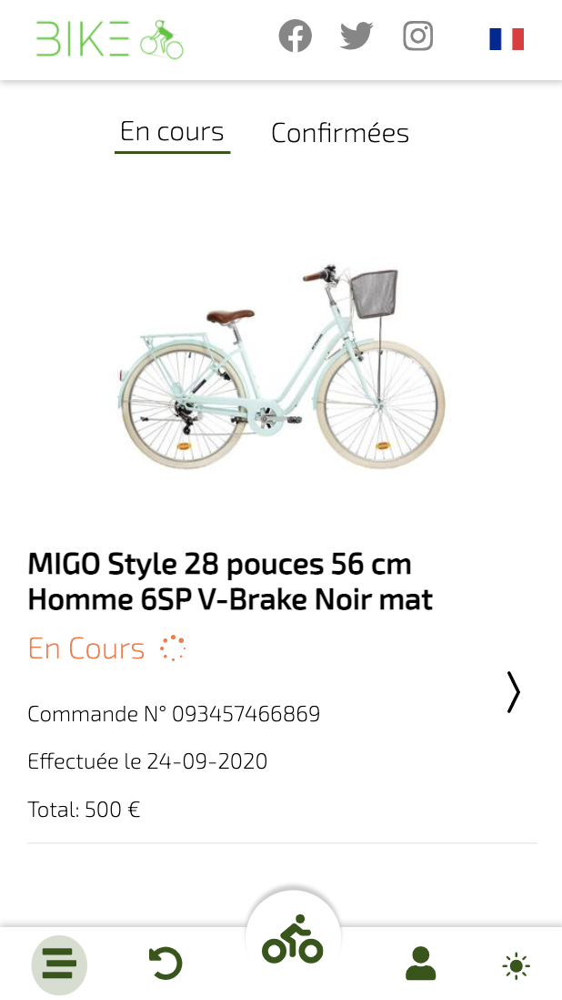

# Bike

## ✨ [Demo](https://bikeday.netlify.app/)

## Installation

Installation du projet

```bash
yarn install
```

Lancer le projet

```bash
yarn start
```

Les variables d'environnement

```bash
REACT_APP_FIREBASE_KEY
REACT_APP_FIREBASE_AUTH_DOMAIN
REACT_APP_FIREBASE_PROJECT_ID
REACT_APP_FIREBASE_STORAGE_BUCKET
REACT_APP_FIREBASE_MESSAGING_SENDER_ID
REACT_APP_FIREBASE_APP_ID
REACT_APP_FIREBASE_MEASUREMENT_ID
```
## Bonus
- API [Notifications server FCM](https://github.com/charif-ayouni/bike-notification-server)
- Context
- Firebase Cloud Messaging (Notifications)
- Firebase Authentication & Cloud firestore
- Stripe

## Les pages

### Page d'accueil


### Page d'accueil ( Dark theme & En )


### Page de la recherche avec Google Map et position de chaque Vélo


### Page de réservation


### Page des reservation (En cours / Confirmées)


